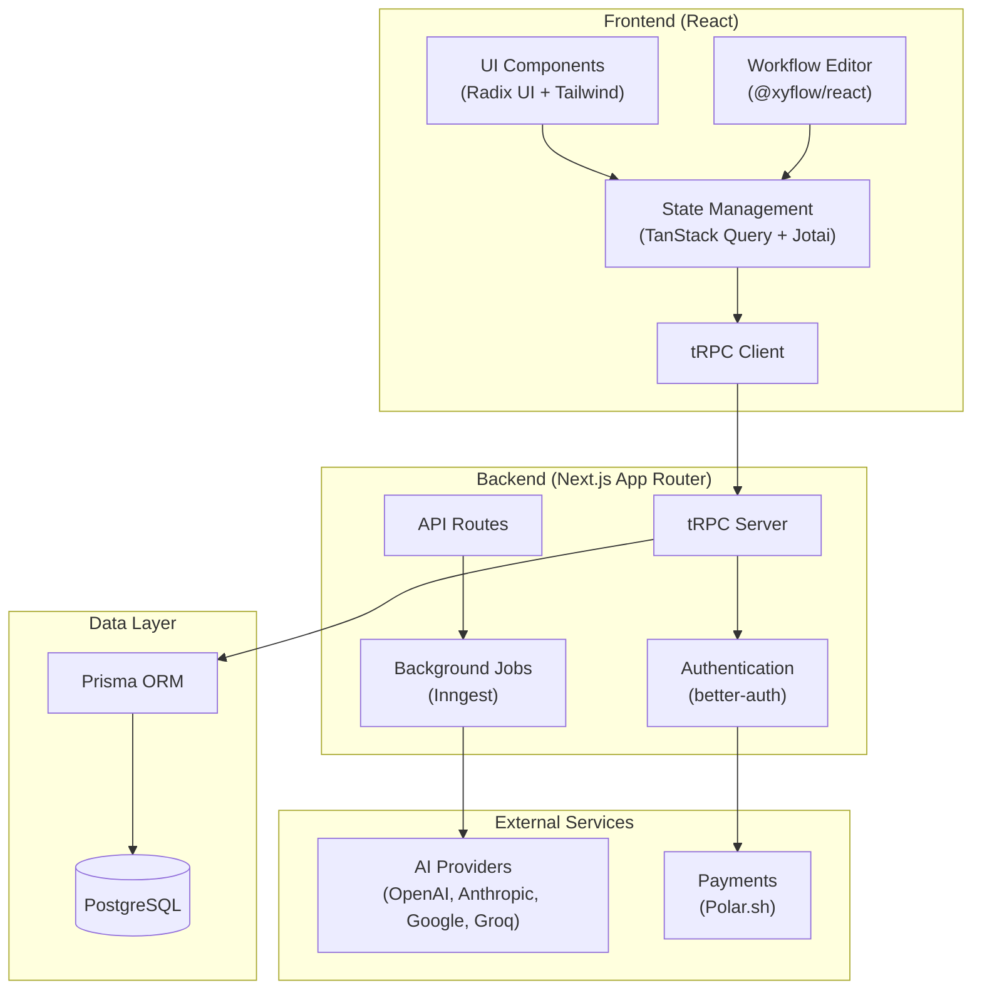
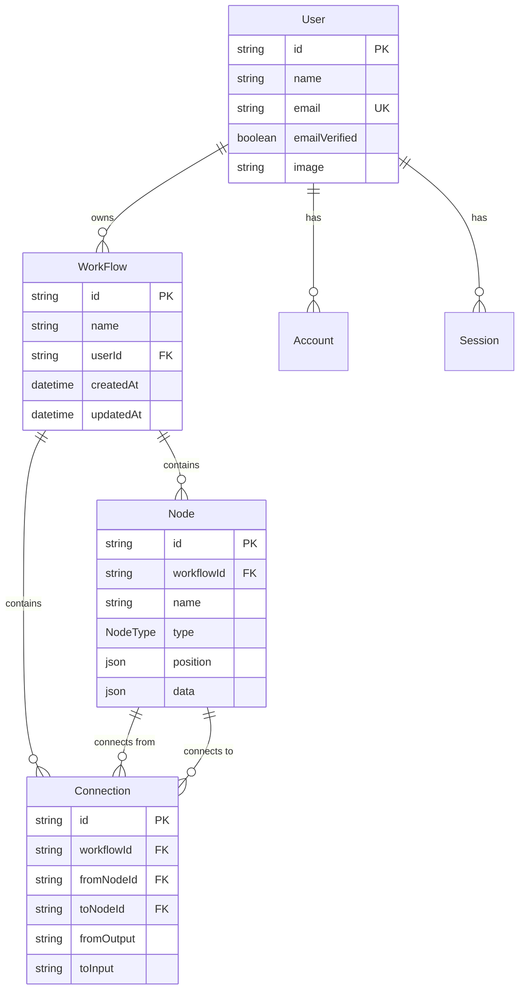

# Synapse

A visual workflow automation platform built with Next.js. Create, manage, and execute automated workflows through an intuitive drag-and-drop interface.

## Architecture



## Project Structure

```
synapse/
├── app/                    # Next.js App Router
│   ├── (auth)/             # Authentication pages
│   ├── (mainlayout)/       # Main application pages
│   ├── api/                # API routes (tRPC, auth, inngest)
│   └── generated/          # Prisma generated client
├── features/               # Feature modules
│   ├── auth/               # Authentication logic
│   ├── editor/             # Workflow canvas editor
│   ├── executions/         # Execution nodes (HTTP Request, etc.)
│   ├── triggers/           # Trigger nodes (Manual, etc.)
│   ├── workflows/          # Workflow CRUD operations
│   └── subscriptions/      # Premium features
├── components/             # Shared UI components
├── trpc/                   # tRPC configuration
├── prisma/                 # Database schema & migrations
├── inngest/                # Background job definitions
└── lib/                    # Utilities and configurations
```

## Data Model



## Tech Stack

| Layer     | Technology              |
| --------- | ----------------------- |
| Framework | Next.js 16 (App Router) |
| Language  | TypeScript              |
| Database  | PostgreSQL + Prisma     |
| API       | tRPC                    |
| State     | TanStack Query + Jotai  |
| Auth      | better-auth             |
| UI        | Radix UI + Tailwind CSS |
| Editor    | @xyflow/react           |
| AI        | Vercel AI SDK           |
| Jobs      | Inngest                 |
| Payments  | Polar.sh                |

## Getting Started

1. **Install dependencies**

   ```bash
   bun install
   ```

2. **Set up environment variables**

   ```bash
   cp .env.example .env.local
   ```

3. **Set up the database**

   ```bash
   bunx prisma migrate dev
   bunx prisma generate
   ```

4. **Run the development server**

   ```bash
   bun dev
   ```

5. Open [http://localhost:3000](http://localhost:3000)

## Node Types

- **INITIAL** - Starting point for workflows
- **MANUAL_TRIGGER** - Manually triggered workflow execution
- **HTTP_REQUEST** - Make HTTP API calls with configurable method, endpoint, and body

## License

Private project.
